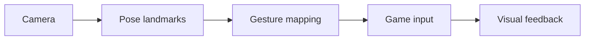

# Vision Game Lab

 

**Move. Play. See the feedback.**

手势与姿态驱动的游戏交互设计。计划连接摄像头识别与游戏控制，让玩家通过身体动作参与小游戏。当前仓库为设计蓝图，尚无可运行游戏。

## Planned interaction loop

| Layer | Planned scope |
|---|---|
| Vision | MediaPipe landmarks and confidence filtering |
| Input | Gesture calibration, smoothing and keyboard fallback |
| Game | A small obstacle-dodging or target-catching scene |
| Telemetry | Input latency and dropped-frame display |

## Reference projects

[MediaPipe](https://github.com/google-ai-edge/mediapipe) · [MonoGame](https://github.com/MonoGame/MonoGame) · [Babylon.js](https://github.com/BabylonJS/Babylon.js)

Engine choice remains open; the first milestone will select one stack.

## Milestones

- [ ] Input protocol and calibration design
- [ ] Keyboard-playable scene
- [ ] Camera-controlled interaction
- [ ] Gameplay recording and measured latency

Camera processing is planned to run locally. Assets and upstream dependencies will be attributed in the implementation.
